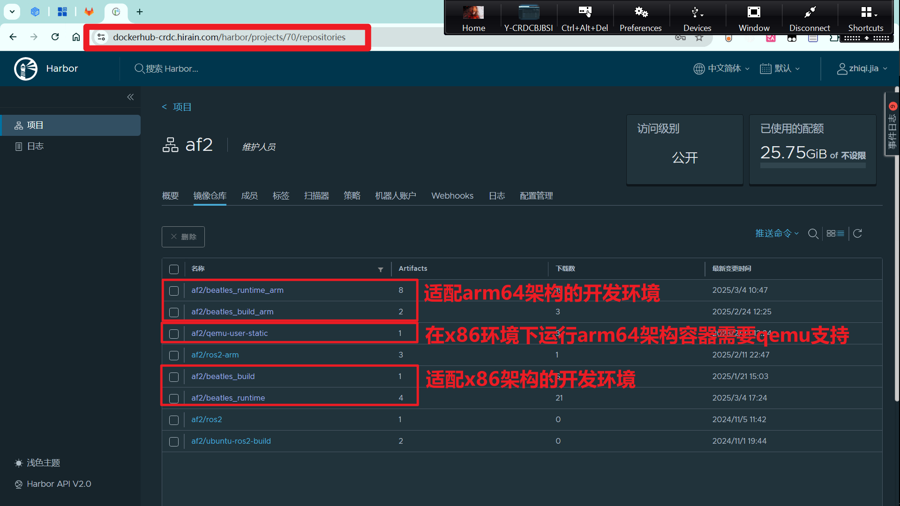
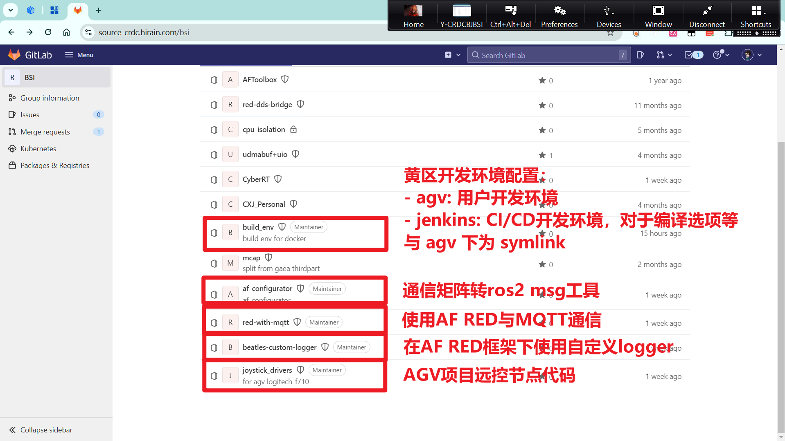
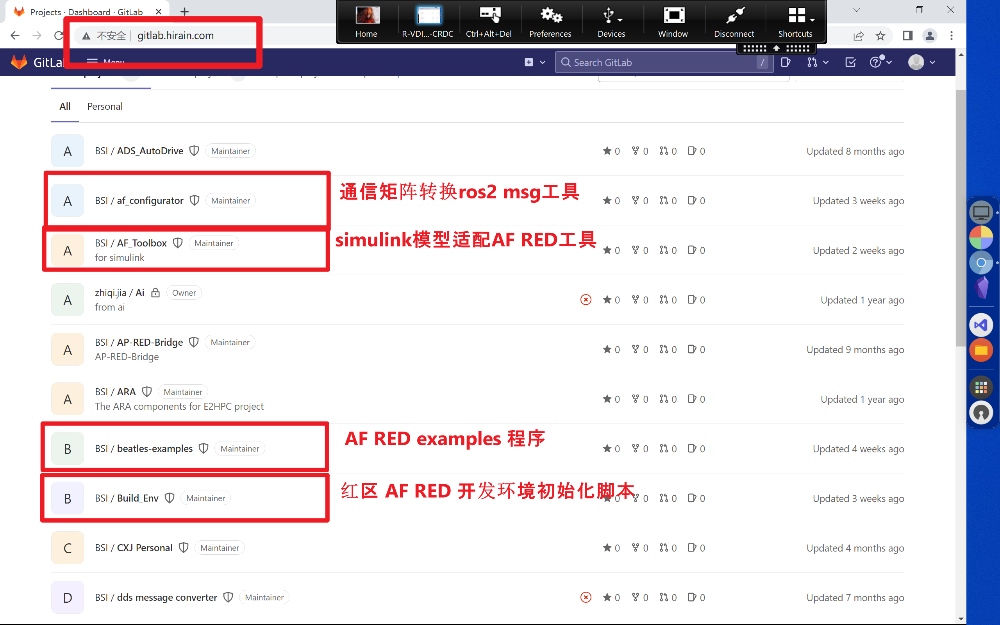
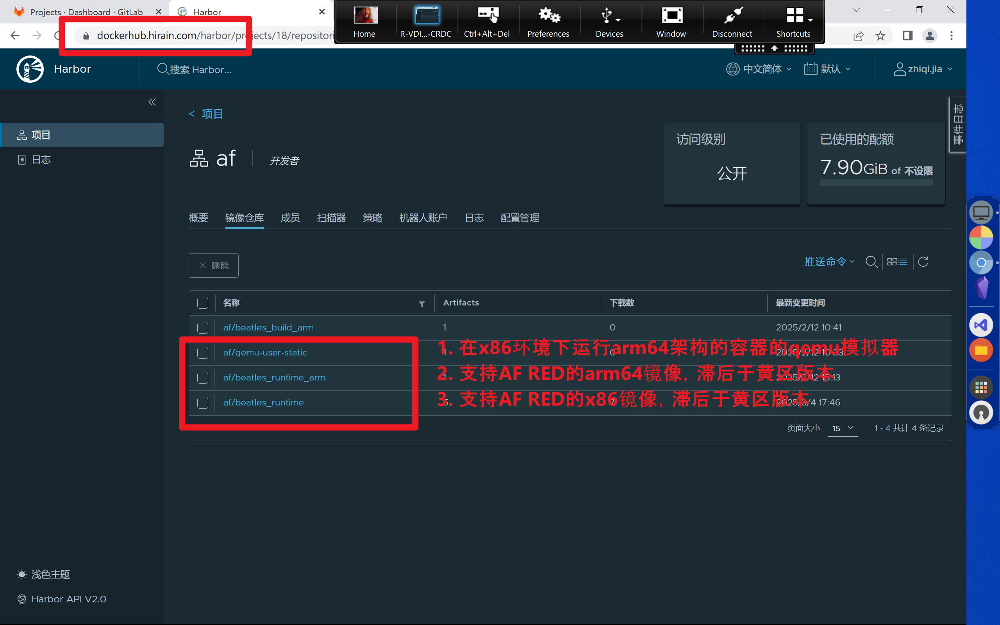

- [开发环境](#开发环境)
  - [黄区](#黄区)
  - [红区](#红区)
- [远控节点](#远控节点)
- [工具链支持](#工具链支持)
- [包管理工具](#包管理工具)
- [性能调优](#性能调优)
- [Plan B](#plan-b)

## 开发环境

已完成对CICD的配置，@jingjing.zhang @yuqiang.zhang @lifeng.cui 较为熟悉

- 流水线
- 开发环境 - x86（复用）
- 开发环境 - arm（复用）

### 黄区

黄区 docker-hub 仓库梳理：

黄区 gitlab 仓库梳理：

### 红区

## 远控节点

- joy，完成功能联调，移交给 @lifeng.cui 维护

## 工具链支持

- matrix，已经由 @yuqiang.zhang 统一维护
- af_toolbox，提供操作录屏，移交给 @qingyu.meng
- af_configurator，移交给 @lei.xiao

## 包管理工具

- am/pm，未定，考虑为 @lei.xiao 继续开发

## 性能调优

- 性能优化

## Plan B

基于 ROS2 开发，部分功能可以实现平替
