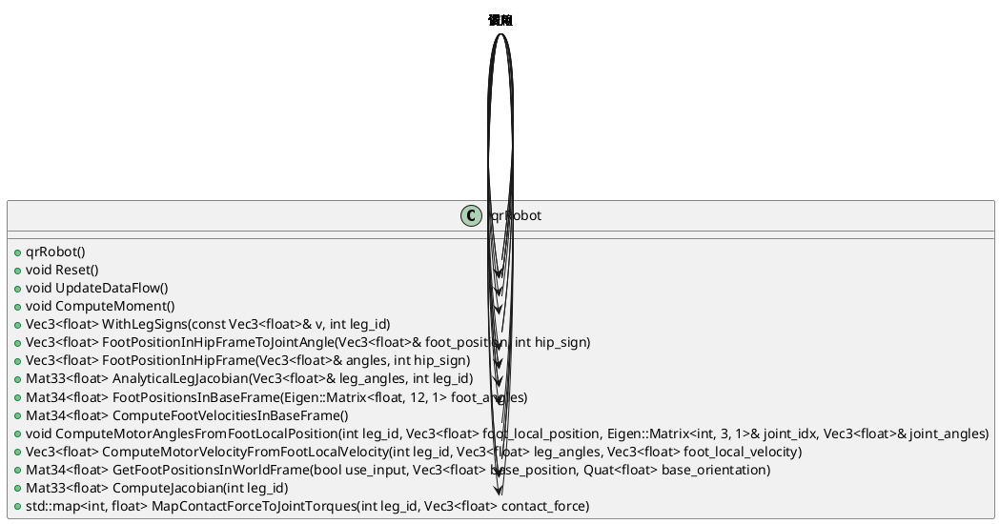

## uml



## 功能关系

`qrRobot` 类是一个模拟四足机器人的控制和运动学计算的类。下面是对该类中各个成员函数的详细分析及其之间的关系：

### 成员函数概述

1. **构造函数 `qrRobot::qrRobot()`**

   - 初始化多个滤波器用于处理传感器数据，如加速度计、陀螺仪、欧拉角等。

2. **`void qrRobot::Reset()`**

   - 重置机器人状态，包括重置偏移量、位置以及滤波器。

3. **`void qrRobot::UpdateDataFlow()`**

   - 更新机器人状态数据流，包括计算雅可比矩阵、足端速度和位置以及基座旋转矩阵。

4. **`void qrRobot::ComputeMoment()`**

   - 计算每个足端的力矩，并基于这些力计算估计的力矩，更新状态数据流中的力矩和足端力。

5. **`Vec3<float> qrRobot::WithLegSigns(const Vec3<float>& v, int leg_id)`**

   - 根据足端索引对输入向量应用符号转换，以反映不同足端的运动方向差异。

6. **`Vec3<float> qrRobot::FootPositionInHipFrameToJointAngle(Vec3<float>& foot_position, int hip_sign)`**

   - 使用逆运动学计算将足端位置转换为对应的关节角度。

7. **`Vec3<float> qrRobot::FootPositionInHipFrame(Vec3<float>& angles, int hip_sign)`**

   - 使用几何计算将关节角度转换为足端在髋关节坐标系中的位置。

8. **`Mat33<float> qrRobot::AnalyticalLegJacobian(Vec3<float>& leg_angles, int leg_id)`**

   - 计算给定关节角度下的足端雅可比矩阵，描述关节角度变化对足端位置的影响。

9. **`Mat34<float> qrRobot::FootPositionsInBaseFrame(Eigen::Matrix<float, 12, 1> foot_angles)`**

   - 计算足端在基座坐标系中的位置。

10. **`Mat34<float> qrRobot::ComputeFootVelocitiesInBaseFrame()`**

    - 计算足端在基座坐标系中的速度，基于雅可比矩阵和关节速度。

11. **`void qrRobot::ComputeMotorAnglesFromFootLocalPosition(int leg_id, Vec3<float> foot_local_position, Eigen::Matrix<int, 3, 1>& joint_idx, Vec3<float>& joint_angles)`**

    - 根据足端位置计算电机角度，并存储关节索引和角度。

12. **`Vec3<float> qrRobot::ComputeMotorVelocityFromFootLocalVelocity(int leg_id, Vec3<float> leg_angles, Vec3<float> foot_local_velocity)`**

    - 基于雅可比矩阵的逆运算，计算电机速度。

13. **`Mat34<float> qrRobot::GetFootPositionsInWorldFrame(bool use_input, Vec3<float> base_position, Quat<float> base_orientation)`**

    - 计算足端在世界坐标系中的位置，支持使用输入的基座位置和姿态。

14. **`Mat33<float> qrRobot::ComputeJacobian(int leg_id)`**

    - 计算指定足端的雅可比矩阵，基于当前的关节角度。

15. **`std::map<int, float> qrRobot::MapContactForceToJointTorques(int leg_id, Vec3<float> contact_force)`**
    - 将足端的接触力映射到对应的电机力矩，通过雅可比矩阵的转置计算。

### 功能与关系分析

#### 1. 初始化与重置

- **构造函数 (`qrRobot::qrRobot`)** 初始化对象和滤波器。
- **`Reset()`** 方法重置机器人状态，包括位置、偏移量和滤波器。

#### 2. 数据更新与计算

- **`UpdateDataFlow()`** 方法更新机器人状态，包括雅可比矩阵、足端速度和位置。
- **`ComputeMoment()`** 计算每个足端的力矩，并更新状态数据流中的力矩。

#### 3. 运动学计算

- **`FootPositionInHipFrameToJointAngle()`** 和 **`FootPositionInHipFrame()`** 分别用于从足端位置到关节角度和从关节角度到足端位置的转换。
- **`AnalyticalLegJacobian()`** 用于计算雅可比矩阵，描述关节角度变化对足端位置的影响。
- **`FootPositionsInBaseFrame()`** 和 **`ComputeFootVelocitiesInBaseFrame()`** 计算足端在基座坐标系中的位置和速度。

#### 4. 电机角度与速度

- **`ComputeMotorAnglesFromFootLocalPosition()`** 计算电机角度。
- **`ComputeMotorVelocityFromFootLocalVelocity()`** 计算电机速度。

#### 5. 世界坐标系计算

- **`GetFootPositionsInWorldFrame()`** 计算足端在世界坐标系中的位置。

#### 6. 力矩映射

- **`MapContactForceToJointTorques()`** 将足端的接触力映射到电机力矩。

### 关系总结

- `Reset()` 和构造函数共同作用于初始化和重置机器人状态。
- `UpdateDataFlow()`、`ComputeMoment()` 和 `ComputeJacobian()` 等函数用于实时更新和计算机器人状态和力学参数。
- `FootPositionInHipFrameToJointAngle()`、`FootPositionInHipFrame()` 和 `AnalyticalLegJacobian()` 是核心的运动学计算函数，用于处理关节角度和足端位置之间的转换。
- `ComputeMotorAnglesFromFootLocalPosition()` 和 `ComputeMotorVelocityFromFootLocalVelocity()` 则处理关节角度和速度的计算。
- `GetFootPositionsInWorldFrame()` 提供世界坐标系中的足端位置。
- `MapContactForceToJointTorques()` 将力学计算结果映射到实际电机力矩。

整个 `qrRobot` 类的功能是实现四足机器人从传感器数据处理、状态更新、运动学计算到电机控制的完整功能，涵盖了从运动学到动力学的多个方面。

## `qrRobot::AnalyticalLegJacobian`

```cpp
/**
 * @brief 计算给定关节角度下的足端雅可比矩阵
 *
 * @param leg_angles 关节角度(髋关节、膝关节、踝关节)
 * @param leg_id 足端的索引(0~3)
 * @return Eigen::Matrix<float, 3, 3> 足端雅可比矩阵
 *
 * 该函数通过解析方法计算足端的雅可比矩阵，该矩阵描述了关节角度变化对足端位置的影响
 */
Eigen::Matrix<float, 3, 3>
qrRobot::AnalyticalLegJacobian(Vec3<float>& leg_angles, int leg_id) {
  float signed_hip_length = hipLength * pow(-1, leg_id + 1);
  Vec3<float> t = leg_angles;

  float l_eff = sqrt(
      upperLegLength * upperLegLength +  //
      lowerLegLength * lowerLegLength +  //
      2 * upperLegLength * lowerLegLength * cos(t[2]));
  float tEff = t[1] + t[2] / 2;

  Eigen::Matrix3f J = Eigen::Matrix3f::Zero();
  J(0, 0) = 0;
  J(0, 1) = -l_eff * cos(tEff);
  J(0, 2) = lowerLegLength * upperLegLength * sin(t[2]) * sin(tEff) / l_eff - l_eff * cos(tEff) / 2;
  J(1, 0) = -signed_hip_length * sin(t[0]) + l_eff * cos(t(0)) * cos(tEff);
  J(1, 1) = -l_eff * sin(t(0)) * sin(tEff);
  J(1, 2) = -lowerLegLength * upperLegLength * sin(t(0)) * sin(t(2)) * cos(tEff) / l_eff -  //
            l_eff * sin(t(0)) * sin(tEff) / 2;
  J(2, 0) = signed_hip_length * cos(t(0)) + l_eff * sin(t(0)) * cos(tEff);
  J(2, 1) = l_eff * sin(tEff) * cos(t(0));
  J(2, 2) = lowerLegLength * upperLegLength * sin(t(2)) * cos(t(0)) * cos(tEff) / l_eff +  //
            l_eff * sin(tEff) * cos(t(0)) / 2;

  return J;
}
```

以下是对 `qrRobot::AnalyticalLegJacobian` 函数的实现细节的详细解释，并使用 LaTeX 表示其中的数学计算。

### 函数目的

该函数通过解析方法计算四足机器人某条腿在给定关节角度下的足端雅可比矩阵（Jacobian Matrix）。雅可比矩阵描述了关节角度的微小变化如何影响足端位置的变化。它在运动学、动力学计算中至关重要，尤其是在逆运动学和控制算法中。

### 输入参数

- `leg_angles`：一个包含髋关节、膝关节和踝关节角度的向量 $\mathbf{t} = [t_0, t_1, t_2]^T$。
- `leg_id`：腿的索引，取值范围为 0 到 3。

### 函数输出

- 返回一个 3x3 的雅可比矩阵 $\mathbf{J}$，它描述了关节角度变化对足端位置的影响。

### 中间变量

- `signed_hip_length`：髋关节长度乘以符号，用于区分不同腿的配置。计算公式：

  $
  \text{signed\_hip\_length} = \text{hipLength} \times (-1)^{\text{leg\_id} + 1}
  $

- `l_eff`：有效腿长（即从髋关节到足端的距离）。计算公式：

  $
  l_{\text{eff}} = \sqrt{L_1^2 + L_2^2 + 2 \cdot L_1 \cdot L_2 \cdot \cos(t_2)}
  $

  其中，\(L_1\) 为大腿的长度，\(L_2\) 为小腿的长度。

- `tEff`：有效关节角度，表示髋关节和膝关节角度的组合。计算公式：

  $
  t_{\text{eff}} = t_1 + \frac{t_2}{2}
  $

### 雅可比矩阵计算

雅可比矩阵 $\mathbf{J}$ 的计算如下：

- 第一行：

  $
  J_{11} = 0, \quad
  J_{12} = -l_{\text{eff}} \cdot \cos(t_{\text{eff}}), \quad
  J_{13} = \frac{L_1 \cdot L_2 \cdot \sin(t_2) \cdot \sin(t_{\text{eff}})}{l_{\text{eff}}} - \frac{l_{\text{eff}} \cdot \cos(t_{\text{eff}})}{2}
  $

- 第二行：

  $
  J_{21} = -\text{signed\_hip\_length} \cdot \sin(t_0) + l_{\text{eff}} \cdot \cos(t_0) \cdot \cos(t_{\text{eff}})
  $

  $
  J_{22} = -l_{\text{eff}} \cdot \sin(t_0) \cdot \sin(t_{\text{eff}})
  $

  $
  J_{23} = -\frac{L_1 \cdot L_2 \cdot \sin(t_0) \cdot \sin(t_2) \cdot \cos(t_{\text{eff}})}{l_{\text{eff}}} - \frac{l_{\text{eff}} \cdot \sin(t_0) \cdot \sin(t_{\text{eff}})}{2}
  $

- 第三行：

  $
  J_{31} = \text{signed\_hip\_length} \cdot \cos(t_0) + l_{\text{eff}} \cdot \sin(t_0) \cdot \cos(t_{\text{eff}})
  $

  $
  J_{32} = l_{\text{eff}} \cdot \sin(t_{\text{eff}}) \cdot \cos(t_0)
  $

  $
  J_{33} = \frac{L_1 \cdot L_2 \cdot \sin(t_2) \cdot \cos(t_0) \cdot \cos(t_{\text{eff}})}{l_{\text{eff}}} + \frac{l_{\text{eff}} \cdot \sin(t_{\text{eff}}) \cdot \cos(t_0)}{2}
  $

其中：

- $L_1$ 是大腿长度，即 `upperLegLength`。
- $L_2$ 是小腿长度，即 `lowerLegLength`。
- $t_0$, $t_1$, $t_2$ 分别为髋关节、膝关节、踝关节的角度。

### 总结

该函数通过一系列几何计算，基于给定的关节角度和腿的几何参数，生成了雅可比矩阵。这一矩阵可以用于描述关节角度变化如何影响足端的位置变化，在运动控制和机器人动力学分析中具有重要意义。

## 雅可比矩阵

让我们用一个形象的比喻来解释雅可比矩阵（Jacobian Matrix）在机器人运动学中的作用，尤其是在描述关节角度变化如何影响足端的位置变化。

### 形象的比喻：机器人腿如同人类的手臂

想象一下，你的手臂可以被分为肩膀、肘部和手腕这三个部分，每个部分都有一个关节可以转动。你在举起手臂时，肩膀、肘部和手腕的角度都会发生变化，而你的手最终会移动到一个新的位置。类似的，机器人的腿也有多个关节（例如髋关节、膝关节、踝关节），这些关节的角度变化会影响机器人脚的位置。

### 雅可比矩阵的作用

雅可比矩阵可以被看作是一个“转换器”，它告诉你在当前的关节角度下，如果关节角度发生一个微小的变化，脚的位置会如何变化。它把关节角度的变化（输入）“转换”成了脚的位置变化（输出）。

#### 举个例子：

- **肩膀**（髋关节）的角度增加一点点时，你的手会朝某个方向移动。
- **肘部**（膝关节）的角度变化会导致手在不同方向上移动。
- **手腕**（踝关节）的微小转动也会改变手的位置。

雅可比矩阵就是用来量化和描述这些影响的。具体来说，雅可比矩阵中的每个元素告诉你：一个特定的关节角度变化会在哪个方向上对脚的位置产生影响，以及影响的大小。

### 数学解释

在数学上，如果你知道每个关节角度的变化（用向量 $\Delta \mathbf{q}$ 表示），雅可比矩阵 $\mathbf{J}$ 可以帮助你计算出脚的位置变化（用向量 $\Delta \mathbf{x}$ 表示）：

$
\Delta \mathbf{x} = \mathbf{J} \cdot \Delta \mathbf{q}
$

这意味着：

- **$\Delta \mathbf{q}$** 是关节角度的微小变化。
- **$\mathbf{J}$** 是雅可比矩阵，它描述了每个关节角度变化对足端位置变化的贡献。
- **$\Delta \mathbf{x}$** 是足端位置的变化。

### 实际意义

在机器人控制中，如果你想让机器人的脚移动到一个特定的位置，你需要知道如何调整各个关节的角度。雅可比矩阵帮助你理解每个关节角度对脚的位置影响，从而在控制算法中做出正确的关节调整。

总的来说，雅可比矩阵是将“关节空间”与“任务空间”（即脚的位置空间）联系起来的桥梁，它让我们能够精确地控制机器人的动作。
